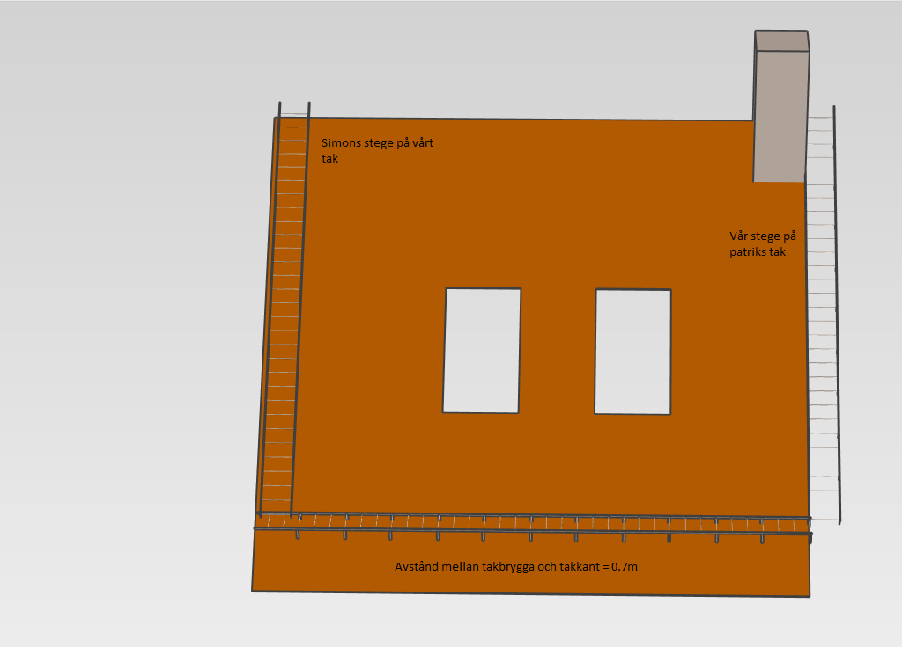
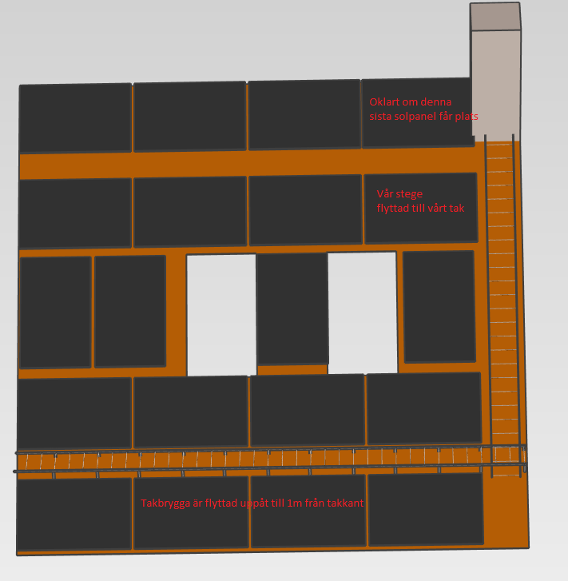

# Förberedelser av tak för solpaneler:
- takbryggan ligger fel i förhållande till solpanelerna eftersom den ligger enbart 0.7m från takkanten.
- Stegarna från takbryggan till skorstenarna ligger på varandras tak.
# Mätningar på taket

# förslag 1 för solceller

# Summering:
- Montera takbryggan högre upp. Borde vara lättare då man kan sitta på den gamla medan man monterar den nya.
- Flytta stegen på gaveln så att man får takbryggan till vänster stegen när man kommer upp (byta ut gavelstegen?)
- Flytta/byta ut våra stegar till skorstenarna
- Totalt antal solpaneler på Grafströms tak: 19-20st => 8kW för paneler med 400W effekt

# Fundering:
- Nuvarande förslag på stege till skorstenen gör att det blir svår att komma åt baksidan på skorstenen som kan vara bra när man t.ex fogar om den. Kanske kan man ta bort panelen till vänster om skorstenen och montera taksteg istället för en hel stege.

# Material:
- TBJ verkar vara standard och takbryggor säljs i längder om 1.2 eller 2.4 m sektioner (https://www.tjb.se/underkategori/takstege-takbrygga)
- Pris sektion 2.4m: ca 3400:- (https://www.byggmax.se/takbrygga-r%C3%A5spont-24m-tjb-p6334831#1224=53295) ca 10.000kr för takbryggan /hushåll
- Pris stege gavel??
- pris stege till skorsten ??

